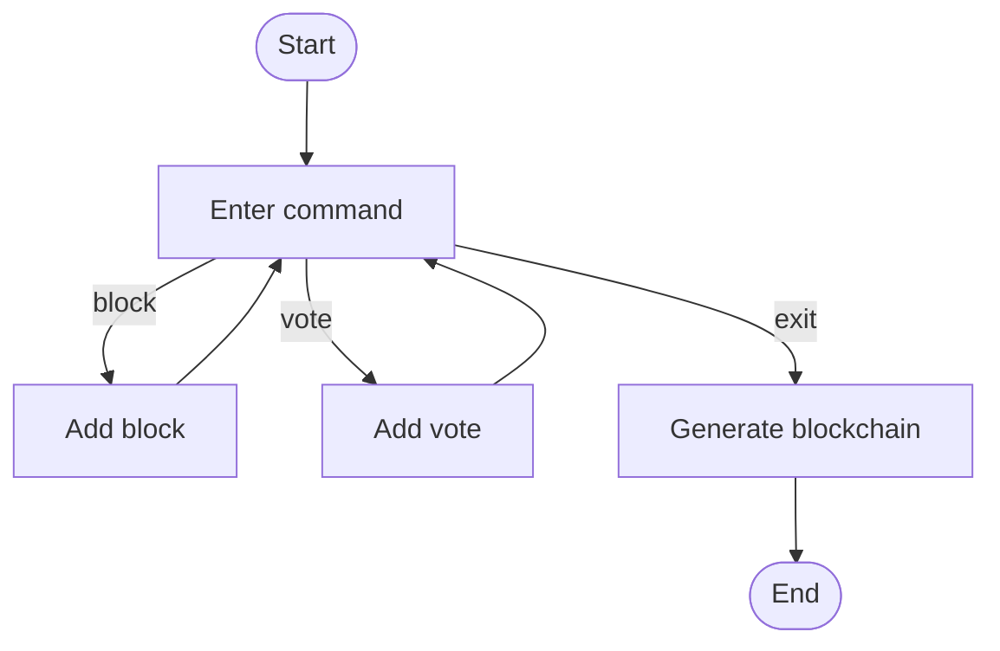

# BlockProcessor: Simple Blockchain Simulation

## Проєкт

Це простий Python-проєкт для створення блокчейну на основі блоків і голосів.


## Структура

**Файли в проєкті:**

* `labka1.py` – головна логіка
* `test.py` – тести
* `README.md` – цей файл документації


## Функціональність

*Цей проєкт імітує **базову** логіку блокчейну. 
Він дозволяє додавати блоки та голоси, після чого формує ланцюг.*

## Команди користувача

* block – додати блок
* vote – додати голос
    * додайте ID блоку
* exit – завершити

### Формат вводу

1. Запустіть скрипт
2. Введіть команду
3. Перегляньте результат:
    1. Вивід блокчейну
    2. Перехід до наступного блоку

## Функції

| Функція            | Опис                               |
|--------------------|:----------------------------------:|
| `add_block`        | Додає блок, якщо його ще не було   |
| `add_vote`         | Додає голос, якщо він новий        |
| `make_blockchain`  | Формує блокчейн з блоків і голосів |

---

## Додавання блоків

```
def add_block(self, block):
    if block['id'] in self.blocks:
        return False
    self.blocks[block['id']] = block["view"]
    return True
```


